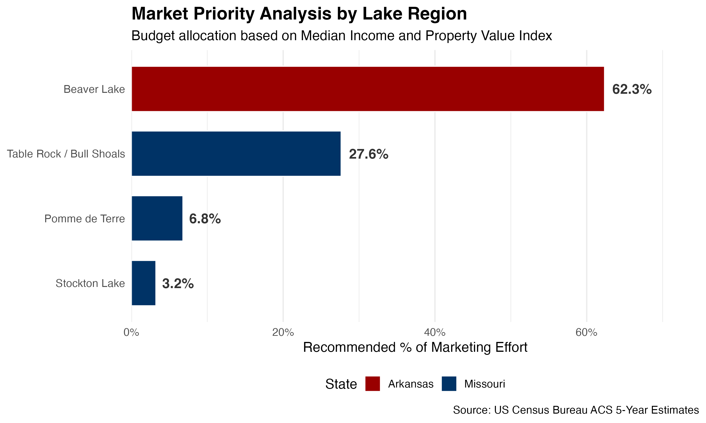

# Lake Region Market Priority Analysis
**Targeted Demographic Scoring for Regional Marketing Strategy**

## 📊 Project Overview
This project provides a data-driven framework for allocating marketing budgets across specific geographic regions. Using US Census Bureau ACS 5-Year estimates, this analysis identifies high-value "Market Hotness" zones by intersecting household income with median property values. 

While originally developed for a regional service provider (**Sho Me Touchless Boatcovers**), the methodology is scalable for any business offering premium home or outdoor services.

## 🛠️ The "Market Hotness" Formula
To move beyond simple population metrics, I developed a weighted index to score each Census Tract:

$$Score = \left(\frac{\text{Median Income}}{1,000}\right) + \left(\frac{\text{Median Home Value}}{5,000}\right)$$

This formula ensures that the strategy prioritizes regions where customers have both the **disposable income** and the **high-value assets** (waterfront property) that require premium protection services.

## 🗂️ Features
* **Automated Data Pull:** Uses `tidycensus` to fetch real-time socio-economic data directly from the US Census API.
* **Geographic Clustering:** Categorizes over 100+ Census Tracts into four distinct Lake Systems (Beaver Lake, Table Rock/Bull Shoals, Stockton, and Pomme de Terre).
* **Budget Allocation Logic:** Calculates the recommended percentage of marketing effort for each region based on the total cumulative "Hotness" score.
* **Precision Targeting:** Identifies the top 10 specific neighborhoods for hyper-local campaigns (Direct Mail/Geo-fencing).

## 🚀 Visual Output
The script generates a prioritized budget allocation chart:

## 📦 Tech Stack
* **Language:** R
* **Libraries:** `tidyverse` (Data Wrangling), `tidycensus` (API), `ggplot2` (Visualization), `scales` (Formatting), `writexl` (Export).

## 📄 How to Use
1.  Obtain a [Census API Key](https://api.census.gov/data/key_signup.html).
2.  Clone this repository.
3.  Add your key using `census_api_key("YOUR_KEY")`.
4.  Run `lake_market_analysis.R` to generate the updated plot and target spreadsheets.
